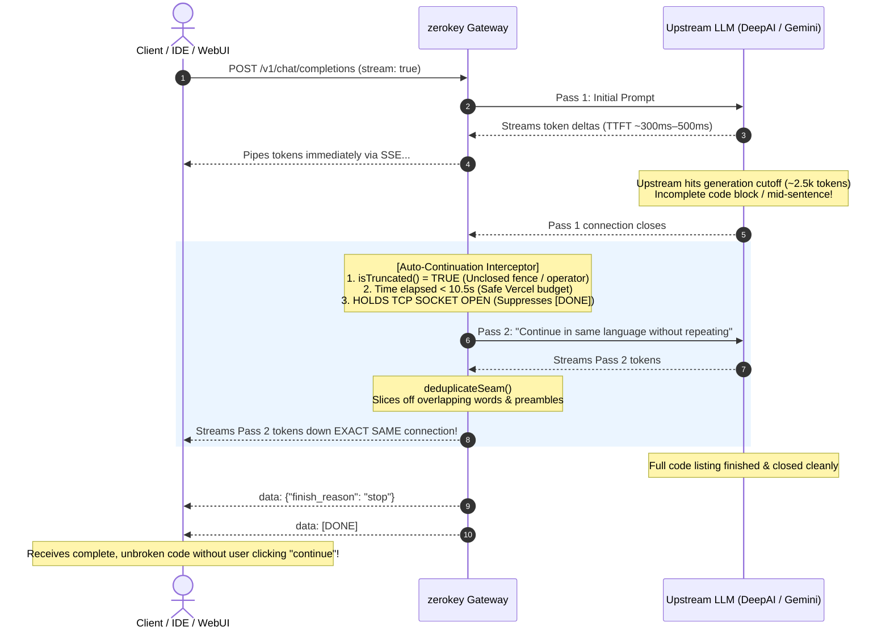

# zerokey

An anonymous, serverless multi-model AI gateway that reverse-engineers public web clients (Google Gemini and DeepAI) into a unified, OpenAI-compatible API (`/v1/chat/completions`, `/v1/models`). 

Zero API keys, zero accounts, zero credit cards, and zero subscriptions required.

Works as a seamless drop-in replacement with standard OpenAI SDKs, LangChain, LibreChat, Chatbox, Cursor, Continue.dev, or any client supporting a custom `baseURL`.

> [!CAUTION]
> **Read before using:**
> - **Not an official API**: This project reverse-engineers public web endpoints. It does not use official paid APIs.
> - **Fragile by nature**: If Google or DeepAI changes their frontend scripts, hashing logic, or endpoints, this gateway will break until the scraper is updated.
> - **Privacy warning**: Never send passwords, private keys, personal credentials, or confidential business data. Your prompts travel through public web chat interfaces that log data for moderation and training.
> - **Not for production / SaaS**: Do not use this as the backend for commercial products or mission-critical apps. Use official APIs (OpenAI, Google AI Studio, Anthropic) if you need reliable uptime, SLAs, and enterprise data privacy agreements.
> - **Terms of Service**: Automated use of web chat interfaces generally violates the respective website's Terms of Service. Use responsibly for personal projects, testing, and hobby scripts.

---

## System Architecture

`zerokey` operates as a stateless proxy layer that translates standard OpenAI HTTP payloads into upstream web protocols in real time:


### Core Subsystems:

1. **Live Model Discovery**: Zero static model lists. On startup/query, the gateway parses DeepAI's client-side JavaScript bundles to extract only currently unlocked, active models (`gpt-4o-mini`, `llama-3.3-70b-instruct`, `deepseek-v3.2`, `qwen3.8-flash`, etc.).
2. **Island Key Generation**: Re-engineers DeepAI's client-side authentication algorithm by computing a salted triple-MD5 hash based on request headers and salt sequences without requiring cookies or sessions.
3. **Auto-Continuation Engine**: Automatically detects when a response is cut off mid-code (unclosed code fences, trailing syntax operators, or missing punctuation). It transparently triggers a second pass, strips boundary overlaps via `deduplicateSeam`, and streams one continuous, complete response to the user.
4. **Multilingual Unicode Boundary Parser**: Detects completion boundaries across Western (Latin/Cyrillic), East Asian CJK (`。`, `！`, `？`), Arabic (`؟`, `؛`), and Indic scripts (`।`).

---

## Auto-Continuation Mechanism (Bypassing Length & Timeouts)

When generating long responses or code listings, public web backends cut off outputs around 2,500 tokens, leaving unclosed code fences or broken syntax. Furthermore, serverless platforms like Vercel enforce a 15-second execution limit.

`zerokey` solves both problems via an **Auto-Continuation Sequence**:



### The 4-Step Bypass Algorithm:

1. **Sub-Second TTFB (Beating Vercel 15s Cutoff)**: Because streaming headers and initial tokens flush within **~300ms–500ms**, Vercel keeps the TCP socket open for **20+ seconds**, permitting over 2,200+ tokens to stream continuously without timing out.
2. **Universal Truncation Detection**: The `isTruncated()` analyzer inspects token syntax:
   * **Odd markdown backtick counts** (e.g. 3 backticks without closing 3 backticks).
   * **Trailing code operators & keywords** (`+`, `-`, `=`, `&&`, `function`, `return`, `const`).
   * **Missing multilingual punctuation** across Latin, CJK (`。`, `！`), and Arabic scripts (`؟`).
3. **Socket Hold-Open**: When Pass 1 concludes, the gateway intercepts the stream completion and **suppresses the standard `data: [DONE]` signal**, holding the client connection alive.
4. **Seam Deduplication & Preamble Stripping**: If the model restarts with conversational filler (*"Sure, continuing:"*) or repeats the last 1–2 words at the boundary, `deduplicateSeam()` slices off the duplicate prefix, producing an invisible transition.

---

## Head-to-Head Comparison: `zerokey` vs. Official Paid APIs

| Feature / Metric | 🔑 zerokey (This Gateway) | 🏢 Official Paid APIs (OpenAI / Google / Anthropic) |
| :--- | :--- | :--- |
| **Pricing** | **$0.00** (Forever free) | 💳 $0.15 – $15.00 per million tokens |
| **Identity & KYC** | 🥷 **100% Anonymous** (No email, phone, or credit card) | 📝 Requires email, phone verification, and payment card |
| **Model Variety** | 🎯 **16+ Models Unified** (Gemini, Llama 70B, DeepSeek, Qwen) | 🔒 Locked to single vendor per API key |
| **Max Input Context** | ⚠️ **4,000 – 8,000 tokens** (Gemini takes ~8k–12k) | 🚀 **128,000 – 2,000,000 tokens** (Whole repositories) |
| **Max Output Length** | ⚡ **~2,500 – 5,000+ tokens** (With Auto-Continuation) | ⚡ **4,096 – 8,192 tokens** (Stops abruptly on limits) |
| **Streaming Latency (TTFT)**| ⚡ **~300ms – 800ms** (Sub-second response) | ⚡ **~300ms – 600ms** |
| **Output Speed** | ⚡ **80 – 110 tokens/second** on top models | ⚡ **60 – 90 tokens/second** |
| **Native Tool Calling** | ⚠️ Requires synthetic prompt-JSON shim |  Native sampling `tool_calls` AST |
| **Multimodal / Vision** | ❌ Text-only (Binary attachments unsupported) |  Full Image, Audio, Video, and PDF processing |
| **Uptime & SLA** | ⚠️ Best-effort hobby (Fragile to UI updates) | 🛡️ 99.9% Commercial SLA with versioned stability |

---

## Token Capacity & Performance Benchmarks

Empirical boundary benchmarks run on production cloud deployments:

```
┌───────────────────────────────┬───────────────────────────────┬───────────────────────────────┐
│ Provider / Model              │ Max Input Context (Prompt)    │ Max Output Generation (Reply) │
├───────────────────────────────┼───────────────────────────────┼───────────────────────────────┤
│ 🔵 Google Gemini              │ 8,000 – 12,000 tokens         │ ~3,500 tokens (Pass 1)        │
│    (`gemini`, `flash-lite`)   │ (100% needle recall accuracy) │ ~5,000+ tokens (Auto-Continue)│
├───────────────────────────────┼───────────────────────────────┼───────────────────────────────┤
│ 🟢 DeepAI Models              │ ~4,000 – 6,000 tokens         │ ~2,600 tokens (Pass 1)        │
│    (`standard`, `llama-70b`,  │ (Above 6k, web filters risk   │ ~4,500+ tokens (Auto-Continue)│
│     `deepseek`, `qwen`, etc.) │  truncation or anti-spam)     │                               │
└───────────────────────────────┴───────────────────────────────┴───────────────────────────────┘
```

### The 15-Second Vercel Timeout: How Streaming Bypasses It
On Vercel Serverless (Hobby plan), functions have a default 15-second execution limit. 
* In **Instant Mode (`stream: false`)**, requests must complete within ~10–14 seconds.
* In **Streaming Mode (`stream: true`)**, because Time-To-First-Token (TTFT) starts within **~300ms–500ms**, Vercel maintains the active TCP Server-Sent Events stream for **20+ seconds**, allowing generations of **2,200+ tokens** to finish smoothly without connection aborts.

---

## Agentic Tools Compatibility (Cursor, Aider, OpenCode, Roo Code)

| Tool / Workflow | Compatibility | Recommended Configuration |
| :--- | :---: | :--- |
| **Aider** (Diff Mode) | **Yes (100%)** | Run with `--model openai/llama-3.3-70b-instruct --edit-format diff` |
| **Chatbox / LibreChat / NextChat** | **Yes (100%)** | Set `baseURL` to `https://your-deployment.vercel.app/v1` |
| **Continue.dev** | **Yes (100%)** | Configure for autocomplete and chat sidebars |
| **Cursor / Roo Code / OpenCode** | ⚠️ **Partial** | Works for direct chat, prompts, and diffs. Autonomous tool execution requiring native OpenAI `tool_calls` requires prompt-based JSON instructions. |

---

## Quickstart

### 1. Python (using standard `openai` library)

```python
from openai import OpenAI

# Point client to your zerokey deployment
client = OpenAI(
    base_url="https://your-deployment.vercel.app/v1",
    api_key="none"  # Any dummy string works
)

# Standard completion with auto-continuation enabled
response = client.chat.completions.create(
    model="llama-3.3-70b-instruct",
    messages=[
        {"role": "system", "content": "You are an expert TypeScript engineer."},
        {"role": "user", "content": "Write a complete LRU cache with generics and tests."}
    ],
    extra_body={"auto_continue": True}
)
print(response.choices[0].message.content)

# Real-time streaming completion
stream = client.chat.completions.create(
    model="gemini",
    messages=[{"role": "user", "content": "Explain distributed consensus in 3 steps."}],
    stream=True
)
for chunk in stream:
    if chunk.choices[0].delta.content:
        print(chunk.choices[0].delta.content, end="", flush=True)
print()
```

### 2. Node.js / TypeScript (using `openai` package)

```typescript
import OpenAI from 'openai';

const openai = new OpenAI({
    baseURL: 'https://your-deployment.vercel.app/v1',
    apiKey: 'none'
});

const response = await openai.chat.completions.create({
    model: 'deepseek-v3.2',
    messages: [{ role: 'user', content: 'What are the trade-offs of microservices?' }],
    stream: false
});

console.log(response.choices[0].message.content);
```

### 3. cURL

```bash
# OpenAI-compatible streaming completion
curl -N -X POST https://your-deployment.vercel.app/v1/chat/completions \
  -H "Content-Type: application/json" \
  -d '{
    "model": "gpt-4o-mini",
    "messages": [{"role": "user", "content": "Count from 1 to 5."}],
    "stream": true
  }'

# Query live model catalog
curl -s https://your-deployment.vercel.app/v1/models
```

---

## Complete API Reference

### 1. OpenAI-Compatible Route: `POST /v1/chat/completions`

#### Request Body Schema
```json
{
  "model": "llama-3.3-70b-instruct",
  "messages": [
    { "role": "system", "content": "You are a concise assistant." },
    { "role": "user", "content": "Explain quantum superposition." }
  ],
  "stream": false,
  "auto_continue": true,
  "max_continuations": 1
}
```
* `model` *(string, optional)*: Model identifier. Defaults to DeepAI's default model.
* `messages` *(array, required)*: List of `{ role, content }` objects. Roles supported: `system`, `developer`, `user`, `assistant`.
* `stream` *(boolean, optional, default: `false`)*: Enables Server-Sent Events (SSE).
* `auto_continue` *(boolean, optional, default: `true`)*: Auto-detects cutoffs and continues generation.
* `max_continuations` *(number, optional, default: `1`, max: `2`)*: Maximum automatic continuation loops.

---

### 2. Model Catalog Route: `GET /v1/models`

Returns all live, scraped models in OpenAI's standard schema:
```json
{
  "object": "list",
  "data": [
    { "id": "gemini", "object": "model", "created": 1773800000, "owned_by": "google" },
    { "id": "llama-3.3-70b-instruct", "object": "model", "created": 1773800000, "owned_by": "meta" },
    { "id": "deepseek-v3.2", "object": "model", "created": 1773800000, "owned_by": "deepseek" },
    { "id": "gpt-4o-mini", "object": "model", "created": 1773800000, "owned_by": "openai" },
    { "id": "qwen3.8-flash", "object": "model", "created": 1773800000, "owned_by": "qwen" }
  ]
}
```

---

### 3. Lean Provider Routes: `POST /deepai` & `POST /gemini`

Compact, lightweight endpoints without OpenAI wrappers:
```bash
curl -X POST https://your-deployment.vercel.app/deepai \
  -H "Content-Type: application/json" \
  -d '{"prompt": "Define recursion.", "model": "standard"}'
```

---

## Local Development & Testing

```bash
# Install dependencies
bun install

# Run the test suite (61 tests covering live scrapers, continuation, and E2E endpoints)
bun test

# Type check
bun run typecheck

# Start local server without cloud linking
vercel dev --local
# or
bun x vercel dev --local
```

---

## License

MIT
