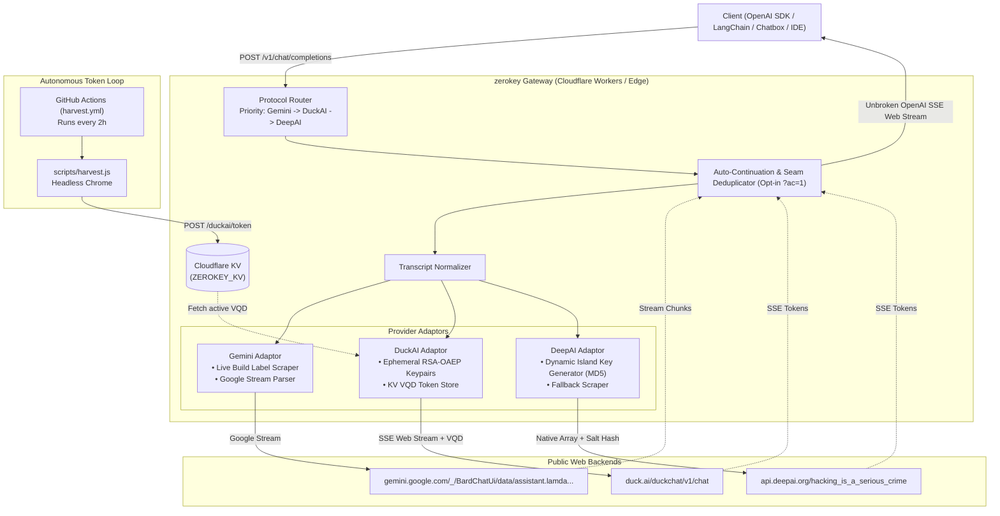
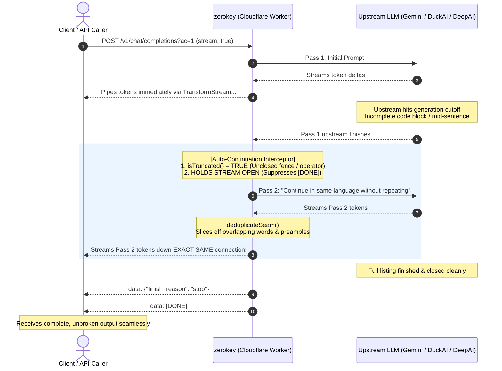

# zerokey

An anonymous, edge-native multi-model AI gateway built for **Cloudflare Workers** that reverse-engineers public web clients (**Google Gemini**, **DuckAI**, and **DeepAI**) into a unified, OpenAI-compatible API (`/v1/chat/completions`, `/v1/models`). 

Zero API keys, zero accounts, zero credit cards, and zero subscriptions required. Runs seamlessly on the **Cloudflare Workers Free Plan** (100,000 req/day).

Works as a seamless drop-in replacement with standard OpenAI SDKs, LangChain, LibreChat, Chatbox, Cursor, Continue.dev, Aider, or any client supporting a custom `baseURL`.

> [!CAUTION]
> **Read before using:**
> - **Not an official API**: This project reverse-engineers public web endpoints. It does not use official paid APIs.
> - **Fragile by nature**: If Google, DuckAI, or DeepAI changes their frontend scripts, hashing logic, or endpoints, this gateway will break until the scraper is updated.
> - **Privacy warning**: Never send passwords, private keys, personal credentials, or confidential business data. Your prompts travel through public web chat interfaces that log data for moderation and training.
> - **Not for production / SaaS**: Do not use this as the backend for commercial products or mission-critical apps. Use official APIs (OpenAI, Google AI Studio, Anthropic) if you need reliable uptime, SLAs, and enterprise data privacy agreements.
> - **Terms of Service**: Automated use of web chat interfaces generally violates the respective website's Terms of Service. Use responsibly for personal projects, testing, and hobby scripts.

---

## System Architecture

`zerokey` operates as a stateless edge proxy layer on Cloudflare Workers using standard Web APIs (`Request`, `Response`, `TransformStream`, `ReadableStream`) that translates standard OpenAI HTTP payloads into upstream web protocols in real time:



### Core Subsystems:

1. **3-Tier Model Priority (`Gemini -> DuckAI -> DeepAI`)**:
   - **Tier 1 (Google Gemini)**: Google's flagship model (`gemini`).
   - **Tier 2 (DuckAI)**: High-performance web models (`gpt-5.6-luna`, `gpt-5.4-mini`, `claude-haiku-4-5`, `mistral-small-2603`, `tinfoil/gpt-oss-120b`, `tinfoil/gemma4-31b`).
   - **Tier 3 (DeepAI Fallback & Missing Only)**: DeepAI models only list what is **missing** from Gemini and DuckAI combined. Overlapping models are filtered out so requests route through DuckAI's superior models.
2. **Autonomous Token Harvesting Loop**:
   - DuckAI requires an active anti-bot challenge pass (`X-Vqd-Hash-1`).
   - A headless Chromium harvester (`scripts/harvest.js`) runs every 2 hours via **GitHub Actions** (`.github/workflows/harvest.yml`).
   - Fresh tokens are pushed to Cloudflare KV (`ZEROKEY_KV`) via `POST /duckai/token` authenticated with `ADMIN_KEY`.
   - The worker reads from KV at runtime with zero redeployments needed.
3. **Dynamic Model Discovery**: Zero static model lists. Catalogs are discovered dynamically from live provider manifests with in-memory TTL caching.
4. **Universal Auto-Continuation (All Providers)**: Works across all models and providers. Auto-continuation is disabled by default and can be opted into via `?ac=1` (or `?auto_continue=true`).
5. **No Wall-Clock Execution Limit**: On Cloudflare Workers, network I/O waiting does not count toward the 10ms CPU time limit, allowing long streams to flow uninterrupted.

---

## Model Priority & Catalog Deduplication

When querying `/v1/models` or sending requests to `/v1/chat/completions`, models are resolved according to strict 3-tier hierarchy:

| Priority | Provider | Models Included | Notes |
| :--- | :--- | :--- | :--- |
| **1 (Highest)** | **Google Gemini** | `gemini` | Flagship Google multimodal model |
| **2** | **DuckAI** | `gpt-5.6-luna`, `gpt-5.4-mini`, `claude-haiku-4-5`, `mistral-small-2603`, `tinfoil/gpt-oss-120b`, `tinfoil/gemma4-31b` | Powered by ephemeral RSA-OAEP envelopes and KV VQD tokens |
| **3 (Fallback)** | **DeepAI** | `standard`, `deepseek-v3`, `llama-3.3-70b-instruct`, `qwen-2.5-72b`, etc. | **Deduplicated**: DeepAI only lists models missing from Gemini and DuckAI |

Explicit provider routing prefixes (`gemini/`, `duckai/`, `deepai/`) can also be specified directly (e.g. `duckai/gpt-5.6-luna` or `deepai/standard`).

---

## Auto-Continuation Mechanism (Opt-in via `?ac=1`)

Public web backends enforce a maximum token output limit per turn (~2,500 tokens on DeepAI, ~4,000 on DuckAI, and ~5,000–8,000 on Google Gemini). Auto-continuation works across **all providers and models**. When a generation cuts off mid-sentence or mid-code (unclosed code fences, trailing syntax operators, or missing terminal punctuation), `zerokey` automatically continues the generation when the `?ac=1` query parameter is present.



### Enabling Auto-Continuation:
Auto-continuation is opt-in strictly via query parameter:
- `/v1/chat/completions?ac=1` or `/v1/chat/completions?auto_continue=true`

When omitted, requests run in standard 1:1 single-turn mode.

---

## Head-to-Head Comparison: `zerokey` vs. Official Paid APIs

| Feature / Metric | 🔑 zerokey (Cloudflare Workers) | 🏢 Official Paid APIs (OpenAI / Google / Anthropic) |
| :--- | :--- | :--- |
| **Pricing** | **$0.00** (Forever free) | 💳 $0.15 – $15.00 per million tokens |
| **Hosting Platform** | ⚡ **Cloudflare Workers Free** (100k req/day) | ☁️ Vendor managed infrastructure |
| **Identity & KYC** | 🥷 **100% Anonymous** (No email, phone, or credit card) | 📝 Requires email, phone verification, and payment card |
| **Model Variety** | 🎯 **20+ Models Unified** (Gemini, Claude Haiku, GPT-5.6, Llama 70B, DeepSeek) | 🔒 Locked to single vendor per API key |
| **Max Input Context** | ⚠️ **4,000 – 8,000 tokens** (Gemini takes ~8k–12k) | 🚀 **128,000 – 2,000,000 tokens** (Whole repositories) |
| **Max Output Length** | ⚡ **~2,500 – 5,000+ tokens** (With `?ac=1`) | ⚡ **4,096 – 8,192 tokens** (Stops abruptly on limits) |
| **Streaming Latency (TTFT)**| ⚡ **~300ms – 800ms** (Sub-second response) | ⚡ **~300ms – 600ms** |
| **Output Speed** | ⚡ **80 – 110 tokens/second** on top models | ⚡ **60 – 90 tokens/second** |
| **Native Tool Calling** | ⚠️ Requires synthetic prompt-JSON shim |  Native sampling `tool_calls` AST |
| **Multimodal / Vision** | ❌ Text-only (Binary attachments unsupported) |  Full Image, Audio, Video, and PDF processing |
| **Uptime & SLA** | ⚠️ Best-effort hobby (Fragile to UI updates) | 🛡️ 99.9% Commercial SLA with versioned stability |

---

## Quickstart

### 1. Python (using standard `openai` library)

```python
from openai import OpenAI

# Point client to your Cloudflare Worker deployment
client = OpenAI(
    base_url="https://zerokey.<your-subdomain>.workers.dev/v1",
    api_key="none"  # Any dummy string works
)

# Chat with DuckAI GPT-5.6 Luna
response = client.chat.completions.create(
    model="gpt-5.6-luna",
    messages=[
        {"role": "system", "content": "You are an expert TypeScript engineer."},
        {"role": "user", "content": "Write a complete LRU cache with generics."}
    ]
)
print(response.choices[0].message.content)

# Real-time streaming with Gemini
stream = client.chat.completions.create(
    model="gemini",
    messages=[{"role": "user", "content": "Explain distributed consensus in 3 steps."}],
    stream=True
)
for chunk in stream:
    if chunk.choices[0].delta.content:
        print(chunk.choices[0].delta.content, end="", flush=True)
print()
```

### 2. Node.js / TypeScript (using `openai` package)

```typescript
import OpenAI from 'openai';

const openai = new OpenAI({
    baseURL: 'https://zerokey.<your-subdomain>.workers.dev/v1',
    apiKey: 'none'
});

const response = await openai.chat.completions.create({
    model: 'claude-haiku-4-5',
    messages: [{ role: 'user', content: 'What are the trade-offs of microservices?' }],
    stream: false
});

console.log(response.choices[0].message.content);
```

### 3. cURL

```bash
# OpenAI-compatible streaming completion
curl -N -X POST https://zerokey.<your-subdomain>.workers.dev/v1/chat/completions \
  -H "Content-Type: application/json" \
  -d '{
    "model": "gpt-5.6-luna",
    "messages": [{"role": "user", "content": "Count from 1 to 5."}],
    "stream": true
  }'

# With opt-in auto-continuation
curl -N -X POST "https://zerokey.<your-subdomain>.workers.dev/v1/chat/completions?ac=1" \
  -H "Content-Type: application/json" \
  -d '{
    "model": "gpt-5.6-luna",
    "messages": [{"role": "user", "content": "Write a long essay on space exploration."}],
    "stream": true
  }'

# Query live unified model catalog
curl -s https://zerokey.<your-subdomain>.workers.dev/v1/models
```

---

## Autonomous Token Harvesting Loop

DuckAI implements an anti-bot challenge mechanism requiring a fresh `X-Vqd-Hash-1` token. Zerokey includes an end-to-end autonomous harvesting loop:

1. **Local Harvesting**:
   ```bash
   bun run harvest
   ```
   Uses headless Chromium to capture a fresh token and updates `.env.local`.

2. **GitHub Actions Autonomous Cron**:
   - The workflow `.github/workflows/harvest.yml` runs every 2 hours on GitHub's infrastructure.
   - Harvests the fresh token and issues an authenticated `POST` to your Cloudflare Worker:
     ```bash
     curl -X POST https://zerokey.<your-subdomain>.workers.dev/duckai/token \
       -H "Authorization: Bearer <ADMIN_KEY>" \
       -H "Content-Type: application/json" \
       -d '{"vqd": "<fresh_vqd_token>"}'
     ```
   - The token is instantly stored in Cloudflare KV (`ZEROKEY_KV`), keeping the DuckAI endpoint alive without requiring worker redeployments.

---

## Complete API Reference

### 1. OpenAI-Compatible Route: `POST /v1/chat/completions`

#### Request Body Schema (100% Standard OpenAI)
```json
{
  "model": "gpt-5.6-luna",
  "messages": [
    { "role": "system", "content": "You are a concise assistant." },
    { "role": "user", "content": "Explain quantum superposition." }
  ],
  "stream": false
}
```
* `model` *(string, optional)*: Model identifier. Priority: Gemini -> DuckAI -> DeepAI.
* `messages` *(array, required)*: List of `{ role, content }` objects. Roles supported: `system`, `developer`, `user`, `assistant`.
* `stream` *(boolean, optional, default: `false`)*: Enables Server-Sent Events (SSE).

*Opt-in continuation*: Pass `?ac=1` or `?auto_continue=true` in query parameter.

---

### 2. Model Catalog Route: `GET /v1/models`

Returns all live, unified models across all 3 providers without duplicates:
```json
{
  "object": "list",
  "data": [
    { "id": "gemini", "object": "model", "created": 1773800000, "owned_by": "google" },
    { "id": "gpt-5.6-luna", "object": "model", "created": 1773800000, "owned_by": "openai" },
    { "id": "gpt-5.4-mini", "object": "model", "created": 1773800000, "owned_by": "openai" },
    { "id": "claude-haiku-4-5", "object": "model", "created": 1773800000, "owned_by": "anthropic" },
    { "id": "mistral-small-2603", "object": "model", "created": 1773800000, "owned_by": "mistral" },
    { "id": "tinfoil/gpt-oss-120b", "object": "model", "created": 1773800000, "owned_by": "tinfoil" },
    { "id": "tinfoil/gemma4-31b", "object": "model", "created": 1773800000, "owned_by": "tinfoil" },
    { "id": "llama-3.3-70b-instruct", "object": "model", "created": 1773800000, "owned_by": "meta" },
    { "id": "deepseek-v3", "object": "model", "created": 1773800000, "owned_by": "deepseek" }
  ]
}
```

---

### 3. Lean Provider Routes: `POST /gemini`, `POST /duckai`, & `POST /deepai`

Compact, lightweight endpoints without OpenAI wrappers:
```bash
# Gemini
curl -X POST https://zerokey.<your-subdomain>.workers.dev/gemini \
  -H "Content-Type: application/json" \
  -d '{"prompt": "Define recursion."}'

# DuckAI
curl -X POST https://zerokey.<your-subdomain>.workers.dev/duckai \
  -H "Content-Type: application/json" \
  -d '{"prompt": "Explain quantum entanglement.", "model": "claude-haiku-4-5"}'

# DeepAI
curl -X POST https://zerokey.<your-subdomain>.workers.dev/deepai \
  -H "Content-Type: application/json" \
  -d '{"prompt": "Define recursion.", "model": "standard"}'
```

---

## Local Development & Deployment

### Run Locally with Wrangler
```bash
# Install dependencies
bun install

# Run local Cloudflare Worker development server (with simulated KV)
bun run dev
# or
bunx wrangler dev
```

### Run Tests & Verification
```bash
# Run full test suite (82 tests covering all scrapers, continuation, router, and Cloudflare Worker)
bun test

# Type check
bun run typecheck
```

### Deploy to Cloudflare Workers
```bash
# Deploy instantly to your Cloudflare account (Free Plan)
bun run deploy
# or
bunx wrangler deploy
```

---

## License

Copyright 2026 hauvuyawi-lab

Permission is hereby granted, free of charge, to any person obtaining a copy of this software and associated documentation files (the “Software”), to deal in the Software without restriction, including without limitation the rights to use, copy, modify, merge, publish, distribute, sublicense, and/or sell copies of the Software, and to permit persons to whom the Software is furnished to do so, subject to the following conditions:

The above copyright notice and this permission notice shall be included in all copies or substantial portions of the Software.

THE SOFTWARE IS PROVIDED “AS IS”, WITHOUT WARRANTY OF ANY KIND, EXPRESS OR IMPLIED, INCLUDING BUT NOT LIMITED TO THE WARRANTIES OF MERCHANTABILITY, FITNESS FOR A PARTICULAR PURPOSE AND NONINFRINGEMENT. IN NO EVENT SHALL THE AUTHORS OR COPYRIGHT HOLDERS BE LIABLE FOR ANY CLAIM, DAMAGES OR OTHER LIABILITY, WHETHER IN AN ACTION OF CONTRACT, TORT OR OTHERWISE, ARISING FROM, OUT OF OR IN CONNECTION WITH THE SOFTWARE OR THE USE OR OTHER DEALINGS IN THE SOFTWARE.
