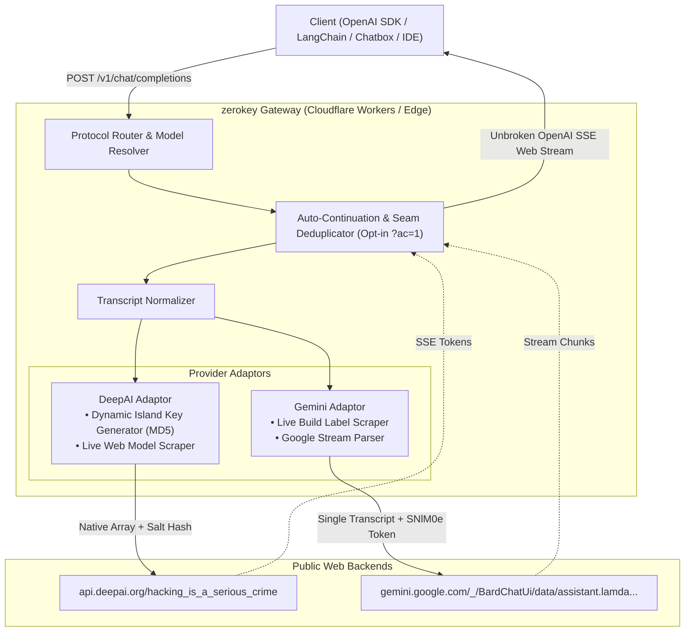
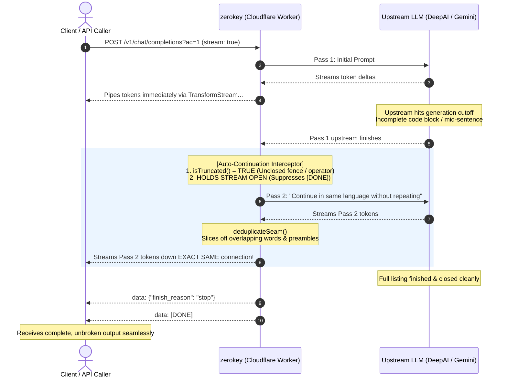

# zerokey

An anonymous, edge-native multi-model AI gateway built for **Cloudflare Workers** that reverse-engineers public web clients (Google Gemini and DeepAI) into a unified, OpenAI-compatible API (`/v1/chat/completions`, `/v1/models`). 

Zero API keys, zero accounts, zero credit cards, and zero subscriptions required. Runs seamlessly on the **Cloudflare Workers Free Plan** (100,000 req/day).

Works as a seamless drop-in replacement with standard OpenAI SDKs, LangChain, LibreChat, Chatbox, Cursor, Continue.dev, Aider, or any client supporting a custom `baseURL`.

> [!CAUTION]
> **Read before using:**
> - **Not an official API**: This project reverse-engineers public web endpoints. It does not use official paid APIs.
> - **Fragile by nature**: If Google or DeepAI changes their frontend scripts, hashing logic, or endpoints, this gateway will break until the scraper is updated.
> - **Privacy warning**: Never send passwords, private keys, personal credentials, or confidential business data. Your prompts travel through public web chat interfaces that log data for moderation and training.
> - **Not for production / SaaS**: Do not use this as the backend for commercial products or mission-critical apps. Use official APIs (OpenAI, Google AI Studio, Anthropic) if you need reliable uptime, SLAs, and enterprise data privacy agreements.
> - **Terms of Service**: Automated use of web chat interfaces generally violates the respective website's Terms of Service. Use responsibly for personal projects, testing, and hobby scripts.

---

## System Architecture

`zerokey` operates as a stateless edge proxy layer on Cloudflare Workers using standard Web APIs (`Request`, `Response`, `TransformStream`, `ReadableStream`) that translates standard OpenAI HTTP payloads into upstream web protocols in real time:



### Core Subsystems:

1. **Edge-Native Architecture**: Built directly with standard Web APIs (`Request`, `Response`, `ReadableStream`, `TransformStream`) running on Cloudflare's global edge network with sub-millisecond cold starts.
2. **Live Model Discovery**: Zero static model lists. On startup/query, the gateway parses DeepAI's client-side JavaScript bundles to extract only currently unlocked, active models (`gpt-4o-mini`, `llama-3.3-70b-instruct`, `deepseek-v3.2`, `qwen3.8-flash`, etc.).
3. **Island Key Generation**: Re-engineers DeepAI's client-side authentication algorithm by computing a salted triple-MD5 hash based on request headers and salt sequences without requiring cookies or sessions.
4. **Universal Auto-Continuation (All Providers)**: Works across all models and providers (Google Gemini and DeepAI). Auto-continuation is disabled by default and can be opted into via `?ac=1` (or `?auto_continue=true`).
5. **No Wall-Clock Execution Limit**: On Cloudflare Workers, network I/O waiting does not count toward the 10ms CPU time limit, allowing long streams to flow uninterrupted without arbitrary serverless kill switches.

---

## Auto-Continuation Mechanism (Opt-in via `?ac=1`)

Public web backends enforce a maximum token output limit per turn (~2,500 tokens on DeepAI, and ~5,000–8,000 tokens on Google Gemini). Auto-continuation works across **all providers and models** (Google Gemini, DeepAI, Llama, DeepSeek, Qwen, etc.). When a generation cuts off mid-sentence or mid-code (unclosed code fences, trailing syntax operators, or missing terminal punctuation), `zerokey` automatically continues the generation when the `?ac=1` query parameter is present.



### Enabling Auto-Continuation:
Auto-continuation is opt-in strictly via query parameter:
- `/v1/chat/completions?ac=1` or `/v1/chat/completions?auto_continue=true`

When omitted, requests run in standard 1:1 single-turn mode.

---

## Head-to-Head Comparison: `zerokey` vs. Official Paid APIs

| Feature / Metric | 🔑 zerokey (Cloudflare Workers) | 🏢 Official Paid APIs (OpenAI / Google / Anthropic) |
| :--- | :--- | :--- |
| **Pricing** | **$0.00** (Forever free) | 💳 $0.15 – $15.00 per million tokens |
| **Hosting Platform** | ⚡ **Cloudflare Workers Free** (100k req/day) | ☁️ Vendor managed infrastructure |
| **Identity & KYC** | 🥷 **100% Anonymous** (No email, phone, or credit card) | 📝 Requires email, phone verification, and payment card |
| **Model Variety** | 🎯 **16+ Models Unified** (Gemini, Llama 70B, DeepSeek, Qwen) | 🔒 Locked to single vendor per API key |
| **Max Input Context** | ⚠️ **4,000 – 8,000 tokens** (Gemini takes ~8k–12k) | 🚀 **128,000 – 2,000,000 tokens** (Whole repositories) |
| **Max Output Length** | ⚡ **~2,500 – 5,000+ tokens** (With `?ac=1`) | ⚡ **4,096 – 8,192 tokens** (Stops abruptly on limits) |
| **Streaming Latency (TTFT)**| ⚡ **~300ms – 800ms** (Sub-second response) | ⚡ **~300ms – 600ms** |
| **Output Speed** | ⚡ **80 – 110 tokens/second** on top models | ⚡ **60 – 90 tokens/second** |
| **Native Tool Calling** | ⚠️ Requires synthetic prompt-JSON shim |  Native sampling `tool_calls` AST |
| **Multimodal / Vision** | ❌ Text-only (Binary attachments unsupported) |  Full Image, Audio, Video, and PDF processing |
| **Uptime & SLA** | ⚠️ Best-effort hobby (Fragile to UI updates) | 🛡️ 99.9% Commercial SLA with versioned stability |

---

## Quickstart

### 1. Python (using standard `openai` library)

```python
from openai import OpenAI

# Point client to your Cloudflare Worker deployment
client = OpenAI(
    base_url="https://zerokey.<your-subdomain>.workers.dev/v1",
    api_key="none"  # Any dummy string works
)

# Standard completion (default, no continuation)
response = client.chat.completions.create(
    model="llama-3.3-70b-instruct",
    messages=[
        {"role": "system", "content": "You are an expert TypeScript engineer."},
        {"role": "user", "content": "Write a complete LRU cache with generics."}
    ]
)
print(response.choices[0].message.content)

# Real-time streaming completion
stream = client.chat.completions.create(
    model="gemini",
    messages=[{"role": "user", "content": "Explain distributed consensus in 3 steps."}],
    stream=True
)
for chunk in stream:
    if chunk.choices[0].delta.content:
        print(chunk.choices[0].delta.content, end="", flush=True)
print()
```

### 2. Node.js / TypeScript (using `openai` package)

```typescript
import OpenAI from 'openai';

const openai = new OpenAI({
    baseURL: 'https://zerokey.<your-subdomain>.workers.dev/v1',
    apiKey: 'none'
});

const response = await openai.chat.completions.create({
    model: 'deepseek-v3.2',
    messages: [{ role: 'user', content: 'What are the trade-offs of microservices?' }],
    stream: false
});

console.log(response.choices[0].message.content);
```

### 3. cURL

```bash
# OpenAI-compatible streaming completion
curl -N -X POST https://zerokey.<your-subdomain>.workers.dev/v1/chat/completions \
  -H "Content-Type: application/json" \
  -d '{
    "model": "gpt-4o-mini",
    "messages": [{"role": "user", "content": "Count from 1 to 5."}],
    "stream": true
  }'

# With opt-in auto-continuation
curl -N -X POST "https://zerokey.<your-subdomain>.workers.dev/v1/chat/completions?ac=1" \
  -H "Content-Type: application/json" \
  -d '{
    "model": "gpt-4o-mini",
    "messages": [{"role": "user", "content": "Write a long essay on space exploration."}],
    "stream": true
  }'

# Query live model catalog
curl -s https://zerokey.<your-subdomain>.workers.dev/v1/models
```

---

## Complete API Reference

### 1. OpenAI-Compatible Route: `POST /v1/chat/completions`

#### Request Body Schema (100% Standard OpenAI)
```json
{
  "model": "llama-3.3-70b-instruct",
  "messages": [
    { "role": "system", "content": "You are a concise assistant." },
    { "role": "user", "content": "Explain quantum superposition." }
  ],
  "stream": false
}
```
* `model` *(string, optional)*: Model identifier. Defaults to DeepAI's default model.
* `messages` *(array, required)*: List of `{ role, content }` objects. Roles supported: `system`, `developer`, `user`, `assistant`.
* `stream` *(boolean, optional, default: `false`)*: Enables Server-Sent Events (SSE).

*Opt-in continuation*: Pass `?ac=1` in query or `X-Auto-Continue: 1` in header.

---

### 2. Model Catalog Route: `GET /v1/models`

Returns all live, scraped models in OpenAI's standard schema:
```json
{
  "object": "list",
  "data": [
    { "id": "gemini", "object": "model", "created": 1773800000, "owned_by": "google" },
    { "id": "llama-3.3-70b-instruct", "object": "model", "created": 1773800000, "owned_by": "meta" },
    { "id": "deepseek-v3.2", "object": "model", "created": 1773800000, "owned_by": "deepseek" },
    { "id": "gpt-4o-mini", "object": "model", "created": 1773800000, "owned_by": "openai" },
    { "id": "qwen3.8-flash", "object": "model", "created": 1773800000, "owned_by": "qwen" }
  ]
}
```

---

### 3. Lean Provider Routes: `POST /deepai` & `POST /gemini`

Compact, lightweight endpoints without OpenAI wrappers:
```bash
curl -X POST https://zerokey.<your-subdomain>.workers.dev/deepai \
  -H "Content-Type: application/json" \
  -d '{"prompt": "Define recursion.", "model": "standard"}'
```

---

## Local Development & Deployment

### Run Locally with Wrangler
```bash
# Install dependencies
bun install

# Run local Cloudflare Worker development server
bun run dev
# or
bunx wrangler dev
```

### Run Tests
```bash
# Run the test suite (63 tests covering live scrapers, continuation, and Cloudflare Worker fetch)
bun test

# Type check
bun run typecheck
```

### Deploy to Cloudflare Workers
```bash
# Deploy instantly to your Cloudflare account (Free Plan)
bun run deploy
# or
bunx wrangler deploy
```

---

## License

MIT
